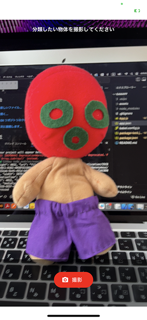

# camApp
React Native(Expo)を用いたカメラアプリの基本

## デモ画面



## Getting Start

```shell
npm install
npm start
```

## Version
- Node.js : v22.0.0
- expo : ~51.0.22,
- expo-camera : ^15.0.14,
- expo-media-library : ^16.0.4,
- react : 18.2.0,
- react-native : 0.74.3
